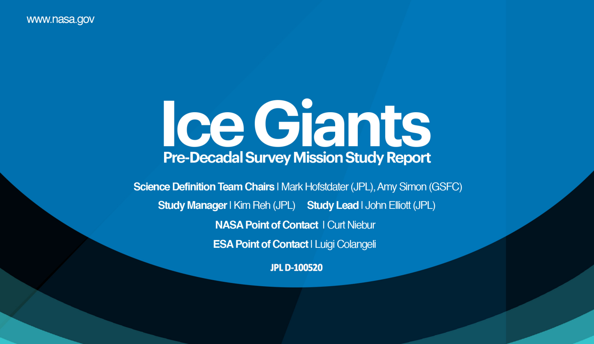

About AMAT
===========

Overview
--------

**AMAT** is an open source collection of Python subroutines for rapid conceptual design of aerocapture and atmospheric Entry, Descent, and Landing (EDL) missions in a Jupyter environment. AMAT comes with a suite of tools to allow end-to-end conceptual design of aerocapture missions: launch vehicle performance calculator, database of interplanetary trajectories, atmosphere models, vehicle control techniques, and aeroheating models. AMAT supports analysis for all atmosphere-bearing Solar System destinations for both lift and drag modulation control techniques.

AMAT has been extensively used in various aerocapture mission studies at the `Advanced Astrodynamics Concepts`_ (AAC) research group at Purdue University in collaboration with the NASA Jet Propulsion Laboratory (JPL). 

.. _Advanced Astrodynamics Concepts: https://engineering.purdue.edu/AAC/

History
-------

The lack of a rapid mission design tool for aerocapture mission concepts was identified by the NASA `Ice Giants Pre Decadal`_ (IGPD) Study led by JPL in 2016. This meant there was no quick way of performing architectural level assessments without resorting to resource intensive, subsystem-level design exercises such as the NASA `Aerocapture Systems Analysis`_ Team studies in 2004. 

.. _Ice Giants Pre Decadal: https://www.lpi.usra.edu/icegiants/
.. _Aerocapture Systems Analysis: https://ntrs.nasa.gov/search.jsp?R=20040111217

A team of researchers at Purdue University (Saikia et al.) led the aerocapture assessment studies in support of IGPD. Graduate researchers have since then further developed and extended the methods and tools for other atmosphere-bearing Solar System destinations. The focus was on developing an integrated systems engineering framework to allow mission designers to quickly evaluate the feasibility and performance of aerocapture mission concepts. Ye Lu and Athul P. Girija from the AAC research group conceptualized the **aerocapture feasibility charts**, now a commonly used graphical method for aerocapture mission design. An earlier version of the feasibility charts was presented by Saikia et al. in the IGPD study report.

Athul P. Girija  formulated a systems framework for rapid conceptual design of aerocapture missions for his doctoral thesis. Much of the AMAT source code was originally written in support of his Ph.D. dissertation work. AMAT was first publicly released in November 2019, and has since then been maintained by the author at Purdue University. In the spirit of `open code for open science`_, AMAT is free and open-source to foster universal access to the knowledge, and allow reproducibility of results by other researchers. Sugestions for improvement and potential contributions are greatly welcome.

.. _open code for open science: https://www.cos.io/about/mission

Related software
----------------

There are industrial software tools which offer mission analysis capabilities for aerocapture missions. These offer much higher fidelity, but are also substantially more complex to set up and run. Such fidelity is most often not required at the level conceptual studies. These tools are not in the public domain, and is generally available only to U.S. government affiliated labs, and U.S. persons at academic or industrial institutions. 

* `POST2`_: According to NASA Langley Research Center, "The Program to Optimize Simulated Trajectories II (POST2) is a generalized point mass, discrete parameter targeting and optimization program. POST2 provides the capability to target and optimize point mass trajectories for multiple powered or un-powered vehicles near an arbitrary rotating, oblate planet. POST2 has been used successfully to solve a wide variety of atmospheric ascent and entry problems, as well as exo-atmospheric orbital transfer problems."

* `DSENDS`_: According to NASA Jet Propulsion Laboratory, "DSENDS is a high-fidelity spacecraft simulator for Entry, Descent and Landing (EDL) on planetary and small-bodies. DSENDS (Dynamics Simulator for Entry, Descent and Surface landing) is an EDL-specific extension of a JPL multi-mission simulation toolkit Darts/Dshell which is capable of modeling spacecraft dynamics, devices, and subsystems, and is in use by interplanetary and science-craft missions such as Cassini, Galileo, SIM, and Starlight. DSENDS is currently in use by the JPL Mars Science Laboratory project to provide a high-fidelity testbed for the test of precision landing and hazard avoidance functions for future Mars missions. "

.. _POST2: https://post2.larc.nasa.gov/
.. _DSENDS: https://dartslab.jpl.nasa.gov/DSENDS/index.php

Future ideas
------------

Some things I would like to implement in the future:

* Pairing AMAT with `Blender`_ and `NASA 3D models`_ of planets and spacecraft to produce high resolution renders of aerocapture vehicle trajectories.

* Improved guidance schemes for lift and drag modulation aerocapture such as direct force control.

* Improved support for EDL mission concepts in the areas of precision landing, parachute dynamics, terminal descent and landing phases.

.. _Blender: https://www.blender.org/
.. _NASA 3D models: https://solarsystem.nasa.gov/resources

Note from the original author
------------------------------

I am `Athul P Girija`_, an aerospace engineer with a passion for robotic exploration of our Solar System. At the time of writing, I am a Ph.D. candidate in the Advanced Astrodynamics Concepts (AAC) research group led by Prof. Sarag Saikia and Prof. James Longuski at Purdue University. My interests lie in the general areas of planetary science, mission design and concept formulation, open-source software, and scientific programming.

AMAT is available for general public use under the GNU GPLv3 license.

`Google Scholar`_

.. _Athul P Girija: https://www.linkedin.com/in/athulpg007/
.. _Google Scholar: https://scholar.google.com/citations?hl=en&user=XxLVDPEAAAAJ
