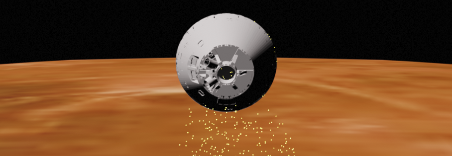

.. AMAT documentation master file, created by
   sphinx-quickstart on Thu May  7 10:27:29 2020.
   You can adapt this file completely to your liking, but it should at least
   contain the root `toctree` directive.

Aerocapture Mission Analysis Tool (AMAT)
========================================

AMAT_ idesigned to provide rapid mission analysis capability for aerocapture and atmospheric Entry, Descent, and
Landing (EDL) mission concepts to the planetary science community.

.. _AMAT: https://github.com/athulpg007/AMAT

See Jupyter_ notebooks to get started or refer to examples_ in the GitHub repository.

.. _Jupyter: https://amat.readthedocs.io/en/latest/jupyter_link.html
.. _examples: https://github.com/athulpg007/AMAT/tree/master/examples

If you find AMAT useful in your work, please consider citing us: Girija et al., (2021).
AMAT: A Python package for rapid conceptual design of aerocapture and atmospheric Entry, Descent, and Landing (EDL)
missions in a Jupyter environment. *Journal of Open Source Software*, 6(67), 3710, `DOI 10.21105/joss.03710`_

.. _DOI 10.21105/joss.03710: https://doi.org/10.21105/joss.03710

AMAT allows the user to simulate atmospheric entry trajectories, compute deceleration
and heating loads, compute aerocapture entry corridors and simulate aerocapture
trajectories. AMAT supports analysis for all atmosphere-bearing destinations
in the Solar System: Venus, Earth, Mars, Jupiter, Saturn, Titan, Uranus, and Neptune.
AMAT allows the calculation of launch performance for a set of launch vehicles.
AMAT allows the calculation of V-inf vector from a Lambert arc for an interplanetary
transfer. AMAT allows calculation of planetary approach trajectories for orbiters and entry
systems from a given V_inf vector, B-plane targeting, and deflection maneuvers.
AMAT allows the calculation of visibility of landers to Earth and relay orbiters
and compute telecom link budgets.

For sub-routine documentation, see :ref:`modindex`

.. toctree::
   :maxdepth: 2
   :caption: Contents:

   about
   installation
   capabilities
   jupyter_link
   jsr-notebooks
   acta-astronautica
   mdpi-aerospace
   other-notebooks
   api_reference
   contributions
   credits
   references
   module_index

Index
==================

* :ref:`genindex`
* :ref:`modindex`
* :ref:`search`
