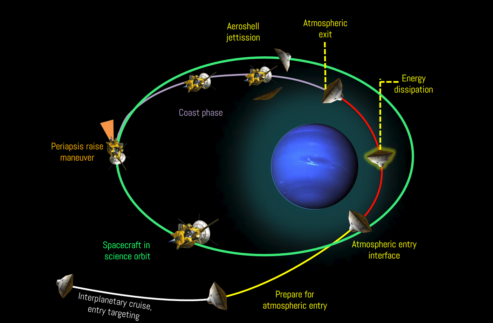

.. AMAT documentation master file, created by
   sphinx-quickstart on Thu May  7 10:27:29 2020.
   You can adapt this file completely to your liking, but it should at least
   contain the root `toctree` directive.

Aerocapture Mission Analysis Tool (AMAT)
========================================

AMAT_ is designed to provide rapid mission analysis capability for aerocapture mission concepts to the planetary science community. 

.. _AMAT: https://github.com/athulpg007/AMAT

See examples_ in github repository.

.. _examples: https://github.com/athulpg007/AMAT/tree/master/examples

AMAT allows the user to peform low-fidelity broad sweep parametric studies; as well as high fidelity Monte Carlo simulations to quantify aerocapture performance. AMAT supports analysis for mission analysis for Venus, Earth, Mars, Titan, Uranus, and Neptune.

and, see module detail :ref:`modindex`

.. toctree::
   :maxdepth: 2
   :caption: Contents:

   about
   installation
   capabilities
   jupyter_link
   module_index

Indices and tables
==================

* :ref:`genindex`
* :ref:`modindex`
* :ref:`search`
